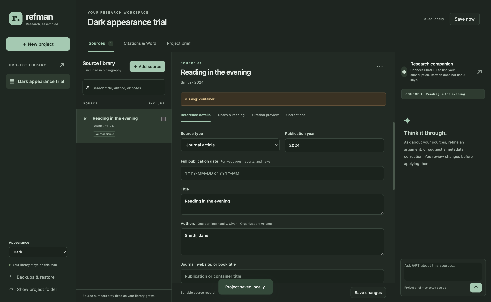

# Refman

**Keep your research, notes and references together—and bring editable citations into Word.**

Refman is a Mac desktop app for organising sources by assignment, taking notes, copying single or combined in-text citations, and updating editable reference lists in Microsoft Word.



## Download the app

**[Download Refman 0.1.0 — friends beta](https://github.com/moaazEl/refman/releases/tag/v0.1.0)**

1. Follow the link above and expand **Assets**.
2. Download **Refman-0.1.0-mac-arm64.zip**. The automatic “Source code” ZIP is not the ready-to-open app.
3. Double-click the ZIP, open its extracted folder, and drag **Refman.app** into **Applications**.
4. Open Refman. No programming or Terminal is needed.

This build requires an **Apple Silicon Mac** (M1 or later). Word integration requires desktop Microsoft Word for Mac. There is no ready-made Intel Mac or Windows build yet.

This is an **unsigned, non-notarised beta**. macOS may block its first launch. If you trust this download, see [Apple’s opening instructions](https://support.apple.com/en-au/102445). Do not disable security protections. If macOS reports damage or malware, stop and report it.

## What it does

- Separate projects for each essay, with your assignment brief and publication-year range.
- DOI and URL import, metadata evidence, missing-detail warnings, and manual corrections.
- Personal notes and PDF, screenshot, text and Word attachments.
- Griffith APA 7 reference previews, parenthetical and narrative citations, and multiple-source citations.
- An **Include in references** checkbox so potential sources stay out of your final list until you use them.
- Editable Word citation insertion and reference-region updates, with a confirmation if you changed that region manually.
- Word reference exports and an advisory citation audit.
- Light, Dark and Follow Mac appearance.
- Automatically updated readable text backups, a project database, attachments and saved versions.

## Start here

Create a project, choose its save location, enter your assignment brief, and add a DOI or URL. Review the imported information, add notes, and check **Include in references** for sources you use. Use **Citation preview** to copy citations and **Citations & Word** to prepare or update your reference list. Try Word updates in a copy of your assignment first.

**[Read the simple user guide](refman-github/docs/USER-GUIDE.md)** · **[Full details](refman-github/README.md)** · **[What was tested](refman-github/docs/TESTING.md)**

## ChatGPT and cost

Refman itself is free to use. Optional AI features are intended to use each person’s own ChatGPT subscription through the official Codex runtime, without a separate API key. Your plan allowance applies. **Live ChatGPT sign-in, summaries and corrections remain unverified and experimental.** Source organisation, notes, manual corrections, citations, Word updates and backups work without connecting ChatGPT.

AI requests send the supplied assignment context and source material to the service. DOI/web imports contact Crossref and the source website. Refman does not upload your project merely because you open it.

## Keep your work safe

Keep the **whole `.refman` project folder** when backing up or moving computers. It contains the database, readable `project.txt`, original attachments and saved versions. Do not edit a shared or synced folder on two computers at once. Physical second-Mac testing is pending.

Your friends start with an empty library. No personal projects, assignments or login details are included. Check citations against your assignment guidance; unusual source types may need manual overrides. The citation audit is advisory and cannot prove that a source supports a claim.

## Feedback

[Open an issue](https://github.com/moaazEl/refman/issues) with what you clicked, what you expected, and the error message. Remove personal information; do not upload assignments, project backups or credentials.

## Developers

The app source is in **refman-github/**. Use Node.js 22 or newer:

```sh
cd refman-github
npm ci
npm test
npm start
```

Build with `npm run package`. See the [source README](refman-github/README.md) for details and [third-party notices](refman-github/THIRD-PARTY-NOTICES.md). No open-source license has been selected for the app’s own code.

Refman is independent and is not affiliated with Griffith University, Microsoft, OpenAI or EndNote.
